<h1 align="center">✨ Hacktoberfest 2025 Contributions ✨</h1>

<p align="center">
  
</p>

<p align="center">
  <b>🚀 A collaborative open-source initiative for Hacktoberfest 2025! 💻</b><br>
  Learn • Build • Contribute • Celebrate 🎉
</p>

<div align="center">
  
[](https://github.com/recodehive/recode-website/stargazers)
[](https://github.com/recodehive/recode-website/network/members)
[](https://github.com/recodehive/recode-website/pulls)
[](https://github.com/recodehive/recode-website/issues)
[](https://github.com/recodehive/recode-website/graphs/contributors)

</div>

---

## 📜 Table of Contents
- [About](#-about)
- [Features](#-features)
- [Quick Start](#-quick-start)
- [Tech Stack](#-tech-stack)
- [Project Structure](#-project-structure)
- [Contributing](#-contributing)
- [Community](#-community)
- [Project Statistics](#-project-statistics)
- [Contributors](#-contributors)
- [Stay Connected](#-stay-connected)

---

## 📖 About

Hacktoberfest is a month-long celebration of open-source software run by DigitalOcean.  
Contribute to any open-source repo on GitHub and earn cool swag & a T-shirt 👕.  

---

## ✨ Features

- **Hands-On Setup Guides** – Practical walkthroughs for setting up projects, repositories, and development environments  
- **Leaderboards & Challenges** – Track your progress, earn points, and compete with others to stay motivated  
- **Community & Collaboration** – Engage with other learners, share tips, and collaborate on projects  

---

## 🚀 Quick Start

### Prerequisites

- [Node.js](https://nodejs.org/) ≥ 18   

### Installation

**Clone the repository:**
```bash
https://github.com/Nikhil-2002/hacktoberfest2025-contributions.git
cd AnyFolder

Traditional Setup:

bash
Copy code
cd AnyFolder
npm install
npm run dev


📁 Project Structure

HACKTOBERFEST2025-CONTRIBUTIONS/
│
├── CartWithRTK/
│ ├── node_modules/
│ ├── public/
│ └── src/
│
├── CodeWithJs/
├── Cointab/
├── FindNearestMess/
├── HealthcareAssignment/
├── js-practice-platform/
│
├── .gitignore
├── CODE_OF_CONDUCT.md
├── CONTRIBUTORS.md
├── LICENSE
├── README.md
├── package-lock.json
└── package.json

## 🤝 Contributing

We welcome contributions from developers of all skill levels! Here's how you can get started:

```

## 🤝 Contributing

We welcome contributions from developers of **all skill levels**!  
Follow these simple steps to start contributing to Hacktoberfest 2025 🎉

---

### 📝 Contribution Steps

```mermaid
flowchart TD
    style Fork fill:#FFDDC1,stroke:#FF7F50,stroke-width:2px
    style Branch fill:#FFFACD,stroke:#FFD700,stroke-width:2px
    style Edit fill:#E0FFFF,stroke:#00CED1,stroke-width:2px
    style Commit fill:#FFE4E1,stroke:#FF69B4,stroke-width:2px
    style PR fill:#D8BFD8,stroke:#8A2BE2,stroke-width:2px

    Fork[🍴 Fork the Project] --> Branch[🌿 Create a New Branch]
    Branch --> Edit[✏️ Make Your Changes]
    Edit --> Commit[💾 Commit the Changes]
    Commit --> PR[🚀 Open a Pull Request]

    classDef startend fill:#98FB98,stroke:#228B22,stroke-width:2px,color:#000,font-weight:bold;
    class Fork,PR startend;
```

<div align="center">



### Step-by-Step Guide

**Fork the repository** on GitHub

**Clone your fork:**

```bash
git clone https://github.com/your-username/hacktoberfest2025-contributionse.git
cd AnyFolder
```

**Create a new branch:**

```bash
git checkout -b feature/your-feature-name

```

**Make your changes** and test thoroughly

**Commit your changes:**

```bash
git commit -m "Add: brief description of your changes"
```

**Push to your fork:**

```bash
git push origin feature/your-feature-name
```

**Submit a Pull Request** with a detailed description of your changes


<div align="center">


**Happy open-source contributions—here's to your career success! 🎉**


</div>